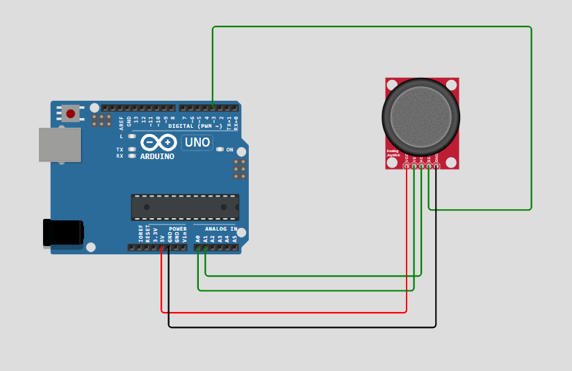

# Simple Arduino Joystick

Repository ini berisi codingan untuk mencoba modul joystick. Modul tersebut disambungkan ke mikrokontroller Arduino Uno

## Diagram



## Cara Penggunaan

1. Buat rangkaian seperti diagram diatas
2. Copy code dibawah ini ke ArduinoIDE

```c++

    int vertical, horizontal;
    bool tombol;

    void setup() {
        // put your setup code here, to run once:
        Serial.begin(9600);
        pinMode(3, INPUT);
    }

    void loop() {
        // put your main code here, to run repeatedly:
        vertical = analogRead(A0);
        horizontal = analogRead(A1);
        tombol = digitalRead(3);

        Serial.print("Vertical: ");
        Serial.print(vertical);

        Serial.print(" | Horizontal: ");
        Serial.print(horizontal);

        Serial.print(" | Click: ");
        Serial.println(tombol);

        delay(500);

    }

```

3. Upload code tersebut ke Arduino Uno